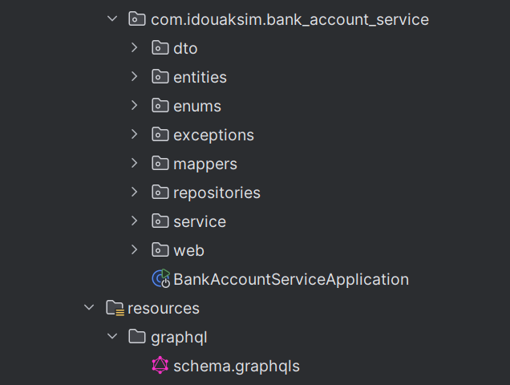
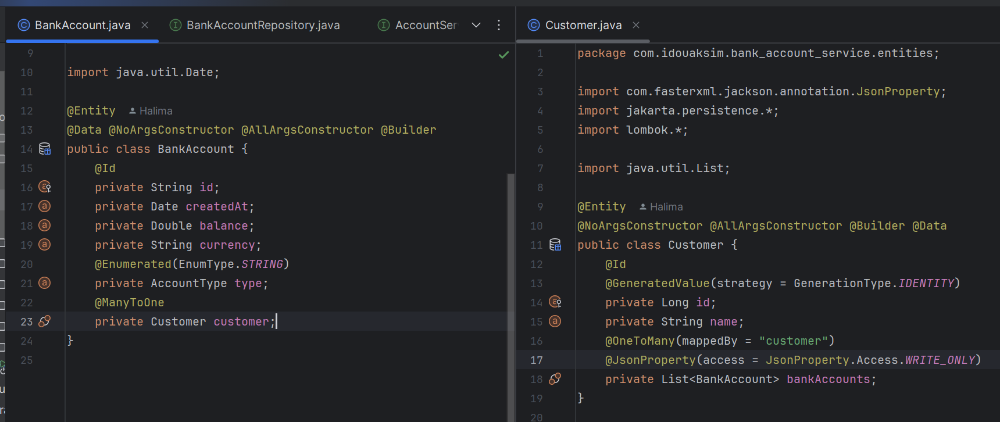
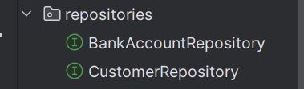
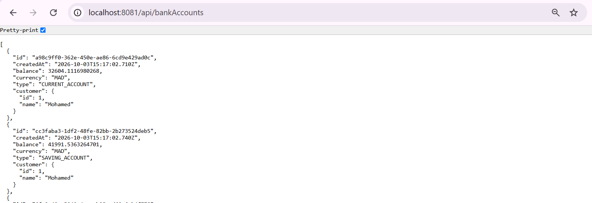
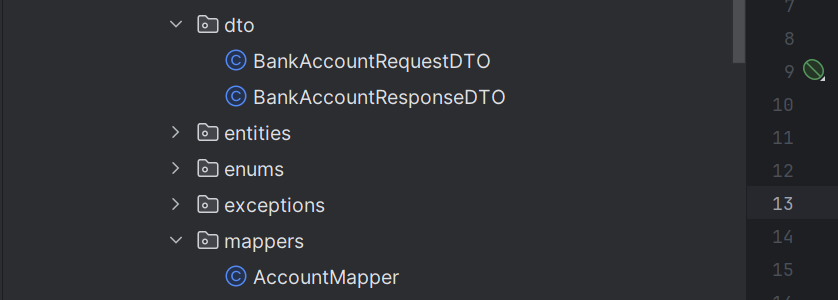
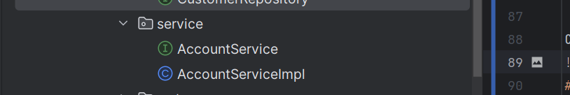
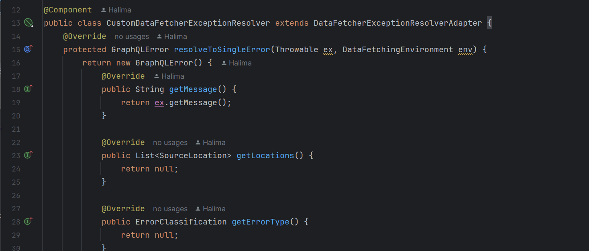

# Bank Accounts Microservice (Spring Boot)

A microservice for managing bank accounts and customers, built with **Spring Boot**. It exposes the same business layer through three APIs: a classic **REST** web service (documented with **Swagger**), **Spring Data REST** (with projections), and **GraphQL**.

This project follows the approach shown in these videos:
- Bank accounts microservice: https://www.youtube.com/watch?v=2-qIoZcvhAw
- GraphQL integration: https://www.youtube.com/watch?v=FsdR09jlqaE

---

## Table of Contents

1. [Technologies](#technologies)
2. [Project Architecture](#project-architecture)
3. [Work Done](#work-done)
    - [1. Project setup](#1-project-setup)
    - [2. JPA entities](#2-jpa-entities)
    - [3. Repository layer and DAO tests](#3-repository-layer-and-dao-tests)
    - [4. RESTful web service](#4-restful-web-service)
    - [5. Swagger documentation](#5-swagger-documentation)
    - [6. Spring Data REST and projections](#6-spring-data-rest-and-projections)
    - [7. DTOs and mappers](#7-dtos-and-mappers)
    - [8. Service layer](#8-service-layer)
    - [9. Exception handling](#9-exception-handling)
    - [10. GraphQL web service](#10-graphql-web-service)
5. [Author](#author)

## Technologies

- Java 17+
- Spring Boot
- Spring Web
- Spring Data JPA
- H2 Database (in-memory)
- Lombok
- Springdoc OpenAPI / Swagger UI
- Spring Data REST
- Spring for GraphQL
- Postman (REST client for testing)

## Project Architecture

Useful URLs (default port `8081`):

| Tool | URL                                    |
|------|----------------------------------------|
| REST API | http://localhost:8081/api/bankAccounts |
| Swagger UI | http://localhost:8081/swagger-ui.html  |
| H2 Console | http://localhost:8081/h2-console       |
| GraphiQL | http://localhost:8081/graphiql         |

## Work Done

### 1. Project setup

Created a Spring Boot project with the following dependencies: **Web, Spring Data JPA, H2, Lombok**.

### 2. JPA entities

Created the JPA entity `BankAccount` (account), then the `Customer` entity linked to accounts.

### 3. Repository layer and DAO tests

Created the `BankAccountRepository` and `CustomerRepository` interface based on Spring Data JPA and tested the DAO layer.

### 4. RESTful web service

Created the REST controller that manages accounts (list, find by id, create, update, delete) and tested it.

### 5. Swagger documentation

Generated and tested the Swagger documentation of the REST API.

### 6. Spring Data REST and projections

Exposed a RESTful API with Spring Data REST, using projections to control which fields are returned.

### 7. DTOs and mappers

Created the DTOs and the mappers to convert between entities and DTOs, so entities are never exposed directly by the API.

### 8. Service layer

Created the business service layer of the microservice, used by both the REST and GraphQL controllers.

### 9. Exception handling

Added a global exception handler to return clear error responses.

### 10. GraphQL web service

Integrated GraphQL into the microservice: schema definition, queries, and mutations.

**Accounts list**
 
**Mutation**

**find Account by id**

**delete Account**

**Customers**

**Customers manipulation with GraphQL**

## Author

- IDOUAKSIM Halima II-BDCC-3
- **Academic year:** _2026/2027_